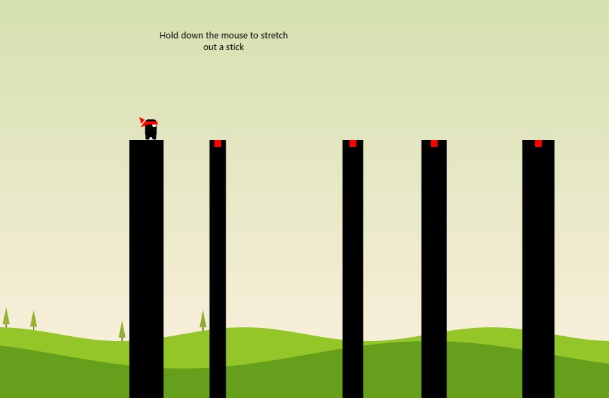

# Stick Man
``` Stick Man made using HTML, CSS, and Javascript```

<br>
<br>

<p>
<i> Video Demo of the Stick Man Game </i>
</p>

<div align="left" >
  <h2>  </h2>
</div>

<br>

<h2> Instructions </h2>
<ul>
  <li>Control a stick figure character</li>
  <li>Use the cursor to create sticks that act as a bridge</li>
  <li>Click and hold the cursor to create a stick</li>
  <li>The longer you hold the cursor, the longer the stick will be</li>
  <li>Release the cursor at the right time to ensure the stick is long enough to cross the gap</li>
  <li>But not so long that it falls short or hits an obstacle</li>
</ul>


 <br>                     

``` Credits: Rujal Tamrakar```

<div float="right" width="400">
  
</div>

<br>


